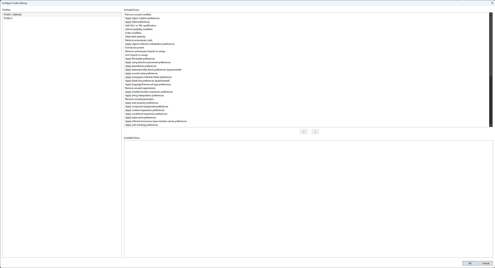

# Hello

This project is a playground for .NET core and github actions.

[](https://sonarcloud.io/summary/new_code?id=patstha_mydotnet)

Add a very aggressive code clean up


Github pages: 
[https://patstha.github.io/mydotnet/](https://patstha.github.io/mydotnet/) 


Learning Benchmark dotnet

``` ini

BenchmarkDotNet=v0.13.5, OS=Windows 11 (10.0.22621.1635/22H2/2022Update/SunValley2)
AMD Ryzen 7 5800X, 1 CPU, 16 logical and 8 physical cores
.NET SDK=7.0.203
  [Host]     : .NET 7.0.5 (7.0.523.17405), X64 RyuJIT AVX2
  DefaultJob : .NET 7.0.5 (7.0.523.17405), X64 RyuJIT AVX2


```
| Method |        Mean |     Error |    StdDev |
|------- |------------:|----------:|----------:|
| Bubble | 62,200.1 μs | 116.72 μs | 109.18 μs |
|  Merge |    291.4 μs |   2.73 μs |   2.56 μs |

[](https://dashboard.stryker-mutator.io/reports/github.com/patstha/mydotnet/master)


```powershell
cd "C:\Users\kushal\src\mydotnet\"; date; dotnet clean; date; dotnet build; date; dotnet test; date; cd "C:\Users\kushal\src\mydotnet\tests\"; date; dotnet test /p:CollectCoverage=true /p:CoverletOutputFormat=cobertura; reportgenerator -reports:coverage.cobertura.xml -targetdir:coverage-report; date; Move-Item -Path "C:\Users\kushal\src\mydotnet\tests\coverage-report\*" -Destination "C:\Users\kushal\src\mydotnet\docs" -Force; date; cd  "C:\Users\kushal\src\mydotnet\"; git add .; date; git status; date; git commit --message "build application" --message "from the terminal" --verbose; date; git pull --rebase origin master --verbose; date; git push origin master --verbose; date;
```

```bash
cd "/home/kushal/src/dotnet/mydotnet/"; date; time dotnet clean; date; time dotnet build; date; time dotnet test; date; cd "/home/kushal/src/dotnet/mydotnet/tests"; date; time dotnet test /p:CollectCoverage=true /p:CoverletOutputFormat=cobertura; reportgenerator -reports:coverage.cobertura.xml -targetdir:coverage-report; date; time mv -f "/home/kushal/src/dotnet/mydotnet/tests/coverage-report/*" "/home/kushal/src/dotnet/mydotnet/docs"; date; cd  "/home/kushal/src/dotnet/mydotnet/"; git add .; date; git status; date; git commit --message "build application" --message "from the terminal" --verbose; date; git pull --rebase origin master --verbose; date; git push origin master --verbose; date;
```

```
kushal@kusfedora2024:~/src/cpp$ cd "/home/kushal/src/dotnet/mydotnet/"; date; time dotnet clean; date; time dotnet build; date; time dotnet test; date; cd "/home/kushal/src/dotnet/mydotnet/tests"; date; time dotnet test /p:CollectCoverage=true /p:CoverletOutputFormat=cobertura; reportgenerator -reports:coverage.cobertura.xml -targetdir:coverage-report; date; time mv -f "/home/kushal/src/dotnet/mydotnet/tests/coverage-report/*" "/home/kushal/src/dotnet/mydotnet/docs"; date; cd  "/home/kushal/src/dotnet/mydotnet/"; git add .; date; git status; date; git commit --message "build application" --message "from the terminal" --verbose; date; git pull --rebase origin master --verbose; date; git push origin master --verbose; date;
Tue Dec  3 03:27:29 PM EST 2024

Build succeeded in 1.4s

real	0m1.702s
user	0m1.107s
sys	0m0.211s
Tue Dec  3 03:27:30 PM EST 2024
Restore complete (1.3s)
  hellolib succeeded (0.7s) → hellolib/bin/Debug/net9.0/hellolib.dll
  hello succeeded (0.7s) → hello/bin/Debug/net9.0/hello.dll
  tests succeeded (1.3s) → tests/bin/Debug/net9.0/tests.dll
  hellobenchamarks succeeded (1.5s) → hellobenchamarks/bin/Debug/net9.0/hellobenchamarks.dll

Build succeeded in 3.9s

real	0m4.208s
user	0m2.797s
sys	0m0.399s
Tue Dec  3 03:27:35 PM EST 2024
Restore complete (1.0s)
  hellolib succeeded (0.1s) → hellolib/bin/Debug/net9.0/hellolib.dll
  tests succeeded (0.2s) → tests/bin/Debug/net9.0/tests.dll
[xUnit.net 00:00:00.00] xUnit.net VSTest Adapter v2.8.2+699d445a1a (64-bit .NET 9.0.0)
[xUnit.net 00:00:00.11]   Discovering: tests
[xUnit.net 00:00:00.23]   Discovered:  tests
[xUnit.net 00:00:00.24]   Starting:    tests
[xUnit.net 00:00:08.88]   Finished:    tests
  tests test succeeded (10.0s)

Test summary: total: 333, failed: 0, succeeded: 333, skipped: 0, duration: 10.0s
Build succeeded in 11.7s

real	0m12.001s
user	0m1.718s
sys	0m0.262s
Tue Dec  3 03:27:47 PM EST 2024
Tue Dec  3 03:27:47 PM EST 2024
Restore complete (0.3s)
  hellolib succeeded (0.1s) → /home/kushal/src/dotnet/mydotnet/hellolib/bin/Debug/net9.0/hellolib.dll
  tests succeeded (0.1s) → bin/Debug/net9.0/tests.dll
[xUnit.net 00:00:00.00] xUnit.net VSTest Adapter v2.8.2+699d445a1a (64-bit .NET 9.0.0)
[xUnit.net 00:00:00.05]   Discovering: tests
[xUnit.net 00:00:00.11]   Discovered:  tests
[xUnit.net 00:00:00.11]   Starting:    tests
[xUnit.net 00:00:06.58]   Finished:    tests
  tests                                                                                   GenerateCoverageResult (7.5s)

+----------+------+--------+--------+
| Module   | Line | Branch | Method |
+----------+------+--------+--------+
| hellolib | 100% | 99.64% | 100%   |
+----------+------+--------+--------+

+---------+------+--------+--------+
|         | Line | Branch | Method |
+---------+------+--------+--------+
| Total   | 100% | 99.64% | 100%   |
+---------+------+--------+--------+
| Average | 100% | 99.64% | 100%   |
+---------+------+--------+--------+
  tests test succeeded (7.6s)

Test summary: total: 333, failed: 0, succeeded: 333, skipped: 0, duration: 7.1s
Build succeeded in 8.4s

real	0m8.588s
user	0m12.640s
sys	0m1.142s
bash: reportgenerator: command not found...
Tue Dec  3 03:27:56 PM EST 2024
mv: cannot stat '/home/kushal/src/dotnet/mydotnet/tests/coverage-report/*': No such file or directory

real	0m0.001s
user	0m0.000s
sys	0m0.001s
Tue Dec  3 03:27:56 PM EST 2024
Tue Dec  3 03:27:56 PM EST 2024
On branch master
Your branch is up to date with 'origin/master'.

Changes to be committed:
  (use "git restore --staged <file>..." to unstage)
	modified:   README.md
	modified:   tests/coverage.cobertura.xml

Tue Dec  3 03:27:56 PM EST 2024
[master e2027aa] build application
 2 files changed, 50 insertions(+), 46 deletions(-)
Tue Dec  3 03:27:56 PM EST 2024
From github.com:patstha/mydotnet
 * branch            master     -> FETCH_HEAD
 = [up to date]      master     -> origin/master
Current branch master is up to date.
Tue Dec  3 03:27:56 PM EST 2024
Pushing to github.com:patstha/mydotnet.git
Enumerating objects: 9, done.
Counting objects: 100% (9/9), done.
Delta compression using up to 16 threads
Compressing objects: 100% (5/5), done.
Writing objects: 100% (5/5), 1.12 KiB | 1.12 MiB/s, done.
Total 5 (delta 4), reused 0 (delta 0), pack-reused 0 (from 0)
remote: Resolving deltas: 100% (4/4), completed with 4 local objects.
To github.com:patstha/mydotnet.git
   3c5a5f1..e2027aa  master -> master
updating local tracking ref 'refs/remotes/origin/master'
Tue Dec  3 03:27:57 PM EST 2024
```

I have a test that only fails some of the time. 

```
kushal@kusfedora2024:~/src/cpp$ cd "/home/kushal/src/dotnet/mydotnet/"; date; time dotnet clean; date; time dotnet build; date; time dotnet test; date; cd "/home/kushal/src/dotnet/mydotnet/tests"; date; time dotnet test /p:CollectCoverage=true /p:CoverletOutputFormat=cobertura; reportgenerator -reports:coverage.cobertura.xml -targetdir:coverage-report; date; time mv -f "/home/kushal/src/dotnet/mydotnet/tests/coverage-report/*" "/home/kushal/src/dotnet/mydotnet/docs"; date; cd  "/home/kushal/src/dotnet/mydotnet/"; git add .; date; git status; date; git commit --message "build application" --message "from the terminal" --verbose; date; git pull --rebase origin master --verbose; date; git push origin master --verbose; date;
Tue Dec  3 03:27:29 PM EST 2024

Build succeeded in 1.4s

real	0m1.702s
user	0m1.107s
sys	0m0.211s
Tue Dec  3 03:27:30 PM EST 2024
Restore complete (1.3s)
  hellolib succeeded (0.7s) → hellolib/bin/Debug/net9.0/hellolib.dll
  hello succeeded (0.7s) → hello/bin/Debug/net9.0/hello.dll
  tests succeeded (1.3s) → tests/bin/Debug/net9.0/tests.dll
  hellobenchamarks succeeded (1.5s) → hellobenchamarks/bin/Debug/net9.0/hellobenchamarks.dll

Build succeeded in 3.9s

real	0m4.208s
user	0m2.797s
sys	0m0.399s
Tue Dec  3 03:27:35 PM EST 2024
Restore complete (1.0s)
  hellolib succeeded (0.1s) → hellolib/bin/Debug/net9.0/hellolib.dll
  tests succeeded (0.2s) → tests/bin/Debug/net9.0/tests.dll
[xUnit.net 00:00:00.00] xUnit.net VSTest Adapter v2.8.2+699d445a1a (64-bit .NET 9.0.0)
[xUnit.net 00:00:00.11]   Discovering: tests
[xUnit.net 00:00:00.23]   Discovered:  tests
[xUnit.net 00:00:00.24]   Starting:    tests
[xUnit.net 00:00:08.88]   Finished:    tests
  tests test succeeded (10.0s)

Test summary: total: 333, failed: 0, succeeded: 333, skipped: 0, duration: 10.0s
Build succeeded in 11.7s

real	0m12.001s
user	0m1.718s
sys	0m0.262s
Tue Dec  3 03:27:47 PM EST 2024
Tue Dec  3 03:27:47 PM EST 2024
Restore complete (0.3s)
  hellolib succeeded (0.1s) → /home/kushal/src/dotnet/mydotnet/hellolib/bin/Debug/net9.0/hellolib.dll
  tests succeeded (0.1s) → bin/Debug/net9.0/tests.dll
[xUnit.net 00:00:00.00] xUnit.net VSTest Adapter v2.8.2+699d445a1a (64-bit .NET 9.0.0)
[xUnit.net 00:00:00.05]   Discovering: tests
[xUnit.net 00:00:00.11]   Discovered:  tests
[xUnit.net 00:00:00.11]   Starting:    tests
[xUnit.net 00:00:06.58]   Finished:    tests
  tests                                                                                   GenerateCoverageResult (7.5s)

+----------+------+--------+--------+
| Module   | Line | Branch | Method |
+----------+------+--------+--------+
| hellolib | 100% | 99.64% | 100%   |
+----------+------+--------+--------+

+---------+------+--------+--------+
|         | Line | Branch | Method |
+---------+------+--------+--------+
| Total   | 100% | 99.64% | 100%   |
+---------+------+--------+--------+
| Average | 100% | 99.64% | 100%   |
+---------+------+--------+--------+
  tests test succeeded (7.6s)

Test summary: total: 333, failed: 0, succeeded: 333, skipped: 0, duration: 7.1s
Build succeeded in 8.4s

real	0m8.588s
user	0m12.640s
sys	0m1.142s
bash: reportgenerator: command not found...
Tue Dec  3 03:27:56 PM EST 2024
mv: cannot stat '/home/kushal/src/dotnet/mydotnet/tests/coverage-report/*': No such file or directory

real	0m0.001s
user	0m0.000s
sys	0m0.001s
Tue Dec  3 03:27:56 PM EST 2024
Tue Dec  3 03:27:56 PM EST 2024
On branch master
Your branch is up to date with 'origin/master'.

Changes to be committed:
  (use "git restore --staged <file>..." to unstage)
	modified:   README.md
	modified:   tests/coverage.cobertura.xml

Tue Dec  3 03:27:56 PM EST 2024
[master e2027aa] build application
 2 files changed, 50 insertions(+), 46 deletions(-)
Tue Dec  3 03:27:56 PM EST 2024
From github.com:patstha/mydotnet
 * branch            master     -> FETCH_HEAD
 = [up to date]      master     -> origin/master
Current branch master is up to date.
Tue Dec  3 03:27:56 PM EST 2024
Pushing to github.com:patstha/mydotnet.git
Enumerating objects: 9, done.
Counting objects: 100% (9/9), done.
Delta compression using up to 16 threads
Compressing objects: 100% (5/5), done.
Writing objects: 100% (5/5), 1.12 KiB | 1.12 MiB/s, done.
Total 5 (delta 4), reused 0 (delta 0), pack-reused 0 (from 0)
remote: Resolving deltas: 100% (4/4), completed with 4 local objects.
To github.com:patstha/mydotnet.git
   3c5a5f1..e2027aa  master -> master
updating local tracking ref 'refs/remotes/origin/master'
Tue Dec  3 03:27:57 PM EST 2024
kushal@kusfedora2024:~/src/dotnet/mydotnet$ 
kushal@kusfedora2024:~/src/dotnet/mydotnet$ cd "/home/kushal/src/dotnet/mydotnet/"; date; time dotnet clean; date; time dotnet build; date; time dotnet test; date; cd "/home/kushal/src/dotnet/mydotnet/tests"; date; time dotnet test /p:CollectCoverage=true /p:CoverletOutputFormat=cobertura; reportgenerator -reports:coverage.cobertura.xml -targetdir:coverage-report; date; time mv -f "/home/kushal/src/dotnet/mydotnet/tests/coverage-report/*" "/home/kushal/src/dotnet/mydotnet/docs"; date; cd  "/home/kushal/src/dotnet/mydotnet/"; git add .; date; git status; date; git commit --message "build application" --message "from the terminal" --verbose; date; git pull --rebase origin master --verbose; date; git push origin master --verbose; date;
Tue Dec  3 03:28:24 PM EST 2024

Build succeeded in 0.8s

real	0m1.081s
user	0m0.938s
sys	0m0.178s
Tue Dec  3 03:28:25 PM EST 2024
Restore complete (0.9s)
  hellolib succeeded (0.2s) → hellolib/bin/Debug/net9.0/hellolib.dll
  hellobenchamarks succeeded (0.4s) → hellobenchamarks/bin/Debug/net9.0/hellobenchamarks.dll
  tests succeeded (0.5s) → tests/bin/Debug/net9.0/tests.dll
  hello succeeded (0.6s) → hello/bin/Debug/net9.0/hello.dll

Build succeeded in 2.0s

real	0m2.320s
user	0m1.863s
sys	0m0.282s
Tue Dec  3 03:28:27 PM EST 2024
Restore complete (0.8s)
  hellolib succeeded (0.1s) → hellolib/bin/Debug/net9.0/hellolib.dll
  tests succeeded (0.1s) → tests/bin/Debug/net9.0/tests.dll
[xUnit.net 00:00:00.00] xUnit.net VSTest Adapter v2.8.2+699d445a1a (64-bit .NET 9.0.0)
[xUnit.net 00:00:00.11]   Discovering: tests
[xUnit.net 00:00:00.21]   Discovered:  tests
[xUnit.net 00:00:00.21]   Starting:    tests
[xUnit.net 00:00:08.15]     tests.DotnetNineGuidTests.GenerateGuidv7_ShouldGenerateGuidv7_sequentially2 [FAIL]
[xUnit.net 00:00:08.15]       Expected firstLong to be less than 17206316598L, but found 256108926307893L (difference of 256091719991295).
[xUnit.net 00:00:08.15]       Stack Trace:
[xUnit.net 00:00:08.15]            at FluentAssertions.Execution.XUnit2TestFramework.Throw(String message)
[xUnit.net 00:00:08.15]            at FluentAssertions.Execution.TestFrameworkProvider.Throw(String message)
[xUnit.net 00:00:08.15]            at FluentAssertions.Execution.DefaultAssertionStrategy.HandleFailure(String message)
[xUnit.net 00:00:08.15]            at FluentAssertions.Execution.AssertionScope.FailWith(Func`1 failReasonFunc)
[xUnit.net 00:00:08.15]            at FluentAssertions.Numeric.NumericAssertions`2.BeLessThan(T expected, String because, Object[] becauseArgs)
[xUnit.net 00:00:08.15]         /home/kushal/src/dotnet/mydotnet/tests/DotnetNineGuidTests.cs(44,0): at tests.DotnetNineGuidTests.GenerateGuidv7_ShouldGenerateGuidv7_sequentially2()
[xUnit.net 00:00:08.15]            at System.RuntimeMethodHandle.InvokeMethod(Object target, Void** arguments, Signature sig, Boolean isConstructor)
[xUnit.net 00:00:08.15]            at System.Reflection.MethodBaseInvoker.InvokeWithNoArgs(Object obj, BindingFlags invokeAttr)
[xUnit.net 00:00:08.82]   Finished:    tests
  tests test failed with 1 error(s) (9.8s)
    /home/kushal/src/dotnet/mydotnet/tests/DotnetNineGuidTests.cs(44): error TESTERROR: 
      tests.DotnetNineGuidTests.GenerateGuidv7_ShouldGenerateGuidv7_sequentially2 (7ms): Error Message: Expected firstLong to be less than 17206316598L, but found 256108926307893L (difference of 256091719991295).
      Stack Trace:
         at FluentAssertions.Execution.XUnit2TestFramework.Throw(String message)
         at FluentAssertions.Execution.TestFrameworkProvider.Throw(String message)
         at FluentAssertions.Execution.DefaultAssertionStrategy.HandleFailure(String message)
         at FluentAssertions.Execution.AssertionScope.FailWith(Func`1 failReasonFunc)
         at FluentAssertions.Numeric.NumericAssertions`2.BeLessThan(T expected, String because, Object[] becauseArgs)
         at tests.DotnetNineGuidTests.GenerateGuidv7_ShouldGenerateGuidv7_sequentially2() in /home/kushal/src/dotnet/mydotnet/tests/DotnetNineGuidTests.cs:line 44
         at System.RuntimeMethodHandle.InvokeMethod(Object target, Void** arguments, Signature sig, Boolean isConstructor)
         at System.Reflection.MethodBaseInvoker.InvokeWithNoArgs(Object obj, BindingFlags invokeAttr)

Test summary: total: 333, failed: 1, succeeded: 332, skipped: 0, duration: 9.8s
Build failed with 1 error(s) in 11.2s

real	0m11.504s
user	0m1.599s
sys	0m0.267s
Tue Dec  3 03:28:38 PM EST 2024
Tue Dec  3 03:28:38 PM EST 2024
Restore complete (0.6s)
  hellolib succeeded (0.3s) → /home/kushal/src/dotnet/mydotnet/hellolib/bin/Debug/net9.0/hellolib.dll
  tests succeeded (0.2s) → bin/Debug/net9.0/tests.dll
[xUnit.net 00:00:00.00] xUnit.net VSTest Adapter v2.8.2+699d445a1a (64-bit .NET 9.0.0)
[xUnit.net 00:00:00.09]   Discovering: tests
[xUnit.net 00:00:00.20]   Discovered:  tests
[xUnit.net 00:00:00.20]   Starting:    tests
[xUnit.net 00:00:10.25]   Finished:    tests
  tests                                                                                  GenerateCoverageResult (12.0s)

+----------+------+--------+--------+
| Module   | Line | Branch | Method |
+----------+------+--------+--------+
| hellolib | 100% | 99.64% | 100%   |
+----------+------+--------+--------+

+---------+------+--------+--------+
|         | Line | Branch | Method |
+---------+------+--------+--------+
| Total   | 100% | 99.64% | 100%   |
+---------+------+--------+--------+
| Average | 100% | 99.64% | 100%   |
+---------+------+--------+--------+
  tests test succeeded (12.1s)

Test summary: total: 333, failed: 0, succeeded: 333, skipped: 0, duration: 11.2s
Build succeeded in 13.8s

real	0m14.093s
user	0m21.474s
sys	0m1.577s
bash: reportgenerator: command not found...
Tue Dec  3 03:28:53 PM EST 2024
mv: cannot stat '/home/kushal/src/dotnet/mydotnet/tests/coverage-report/*': No such file or directory

real	0m0.002s
user	0m0.000s
sys	0m0.002s
Tue Dec  3 03:28:53 PM EST 2024
Tue Dec  3 03:28:53 PM EST 2024
On branch master
Your branch is up to date with 'origin/master'.

Changes to be committed:
  (use "git restore --staged <file>..." to unstage)
	modified:   README.md
	modified:   tests/coverage.cobertura.xml

Tue Dec  3 03:28:53 PM EST 2024
[master 198502d] build application
 2 files changed, 125 insertions(+), 14 deletions(-)
Tue Dec  3 03:28:53 PM EST 2024
From github.com:patstha/mydotnet
 * branch            master     -> FETCH_HEAD
 = [up to date]      master     -> origin/master
Current branch master is up to date.
Tue Dec  3 03:28:53 PM EST 2024
Pushing to github.com:patstha/mydotnet.git
Enumerating objects: 9, done.
Counting objects: 100% (9/9), done.
Delta compression using up to 16 threads
Compressing objects: 100% (5/5), done.
Writing objects: 100% (5/5), 2.65 KiB | 2.65 MiB/s, done.
Total 5 (delta 3), reused 0 (delta 0), pack-reused 0 (from 0)
remote: Resolving deltas: 100% (3/3), completed with 3 local objects.
To github.com:patstha/mydotnet.git
   e2027aa..198502d  master -> master
updating local tracking ref 'refs/remotes/origin/master'
Tue Dec  3 03:28:54 PM EST 2024
kushal@kusfedora2024:~/src/dotnet/mydotnet$ 
```


```bash
$ cd "/home/kushal/src/dotnet/mydotnet/"; date; time dotnet clean; date; time dotnet build; date; time dotnet test; date; cd "/home/kushal/src/dotnet/mydotnet/tests"; date; time dotnet test /p:CollectCoverage=true /p:CoverletOutputFormat=cobertura; reportgenerator -reports:coverage.cobertura.xml -targetdir:coverage-report; date; time mv -f "/home/kushal/src/dotnet/mydotnet/tests/coverage-report/*" "/home/kushal/src/dotnet/mydotnet/docs"; date; cd  "/home/kushal/src/dotnet/mydotnet/"; git add .; date; git status; date; git commit --message "build application" --message "from the terminal" --verbose; date; git pull --rebase origin master --verbose; date; git push origin master --verbose; date;
Fri Dec 20 10:09:05 AM EST 2024

Welcome to .NET 9.0!
---------------------
SDK Version: 9.0.101

----------------
Installed an ASP.NET Core HTTPS development certificate.
To trust the certificate, run 'dotnet dev-certs https --trust'
Learn about HTTPS: https://aka.ms/dotnet-https

----------------
Write your first app: https://aka.ms/dotnet-hello-world
Find out what's new: https://aka.ms/dotnet-whats-new
Explore documentation: https://aka.ms/dotnet-docs
Report issues and find source on GitHub: https://github.com/dotnet/core
Use 'dotnet --help' to see available commands or visit: https://aka.ms/dotnet-cli
--------------------------------------------------------------------------------------

Build succeeded in 0.7s

real	0m0.852s
user	0m0.634s
sys	0m0.130s
Fri Dec 20 10:09:06 AM EST 2024
Restore complete (0.5s)
  hellolib succeeded (0.2s) → hellolib/bin/Debug/net9.0/hellolib.dll
  hello succeeded (0.4s) → hello/bin/Debug/net9.0/hello.dll
  tests succeeded (0.4s) → tests/bin/Debug/net9.0/tests.dll
  hellobenchamarks succeeded (0.6s) → hellobenchamarks/bin/Debug/net9.0/hellobenchamarks.dll

Build succeeded in 1.4s

real	0m1.569s
user	0m1.599s
sys	0m0.358s
Fri Dec 20 10:09:07 AM EST 2024
Restore complete (0.4s)
  hellolib succeeded (0.1s) → hellolib/bin/Debug/net9.0/hellolib.dll
  tests succeeded (0.1s) → tests/bin/Debug/net9.0/tests.dll
[xUnit.net 00:00:00.00] xUnit.net VSTest Adapter v3.0.0+e341b939fe (64-bit .NET 9.0.0)
[xUnit.net 00:00:00.07]   Discovering: tests
[xUnit.net 00:00:00.14]   Discovered:  tests
[xUnit.net 00:00:00.19]   Starting:    tests
[xUnit.net 00:00:08.82]   Finished:    tests
  tests test succeeded (9.4s)

Test summary: total: 338, failed: 0, succeeded: 338, skipped: 0, duration: 9.4s
Build succeeded in 10.2s

real	0m10.348s
user	0m1.004s
sys	0m0.212s
Fri Dec 20 10:09:18 AM EST 2024
Fri Dec 20 10:09:18 AM EST 2024
Restore complete (0.3s)
  hellolib succeeded (0.1s) → /home/kushal/src/dotnet/mydotnet/hellolib/bin/Debug/net9.0/hellolib.dll
  tests succeeded (0.1s) → bin/Debug/net9.0/tests.dll
[xUnit.net 00:00:00.00] xUnit.net VSTest Adapter v3.0.0+e341b939fe (64-bit .NET 9.0.0)
[xUnit.net 00:00:00.06]   Discovering: tests
[xUnit.net 00:00:00.13]   Discovered:  tests
[xUnit.net 00:00:00.17]   Starting:    tests
[xUnit.net 00:00:05.43]   Finished:    tests
  tests                                                                                   GenerateCoverageResult (6.4s)

+----------+------+--------+--------+
| Module   | Line | Branch | Method |
+----------+------+--------+--------+
| hellolib | 100% | 99.64% | 100%   |
+----------+------+--------+--------+

+---------+------+--------+--------+
|         | Line | Branch | Method |
+---------+------+--------+--------+
| Total   | 100% | 99.64% | 100%   |
+---------+------+--------+--------+
| Average | 100% | 99.64% | 100%   |
+---------+------+--------+--------+
  tests test succeeded (6.4s)

Test summary: total: 338, failed: 0, succeeded: 338, skipped: 0, duration: 5.9s
Build succeeded in 7.4s

real	0m7.520s
user	0m13.356s
sys	0m1.134s
bash: reportgenerator: command not found...
Fri Dec 20 10:09:26 AM EST 2024
mv: cannot stat '/home/kushal/src/dotnet/mydotnet/tests/coverage-report/*': No such file or directory

real	0m0.001s
user	0m0.000s
sys	0m0.001s
Fri Dec 20 10:09:26 AM EST 2024
Fri Dec 20 10:09:26 AM EST 2024
On branch master
Your branch is up to date with 'origin/master'.

Changes to be committed:
  (use "git restore --staged <file>..." to unstage)
	modified:   README.md
	modified:   tests/coverage.cobertura.xml

Fri Dec 20 10:09:26 AM EST 2024
[master 962aa0b] build application
 2 files changed, 157 insertions(+), 152 deletions(-)
Fri Dec 20 10:09:26 AM EST 2024
From github.com:patstha/mydotnet
 * branch            master     -> FETCH_HEAD
 = [up to date]      master     -> origin/master
Current branch master is up to date.
Fri Dec 20 10:09:26 AM EST 2024
Pushing to github.com:patstha/mydotnet.git
Enumerating objects: 9, done.
Counting objects: 100% (9/9), done.
Delta compression using up to 16 threads
Compressing objects: 100% (5/5), done.
Writing objects: 100% (5/5), 1.81 KiB | 1.81 MiB/s, done.
Total 5 (delta 4), reused 0 (delta 0), pack-reused 0 (from 0)
remote: Resolving deltas: 100% (4/4), completed with 4 local objects.
To github.com:patstha/mydotnet.git
   28b4ac3..962aa0b  master -> master
updating local tracking ref 'refs/remotes/origin/master'
Fri Dec 20 10:09:27 AM EST 2024
```
