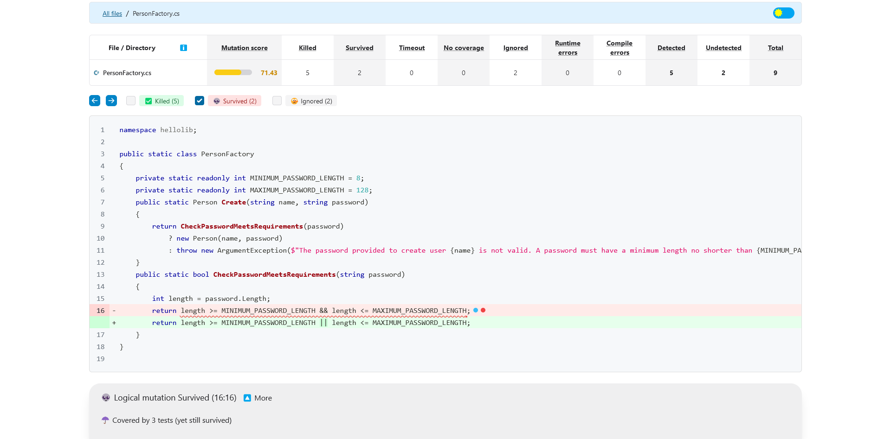

# Testing Stryker

Stryker logs are at [output.txt](https://raw.githubusercontent.com/patstha/mydotnet/master/docs/StrykerOutput/output.txt). 

Take a look at this mutation report though

[StrykerOutput\2023-05-06.03-53-34\reports\mutation-report.html](/StrykerOutput/2023-05-06.03-53-34/reports/mutation-report.html) 




```csharp
namespace hellolib;

public static class PersonFactory
{
    private static readonly int MINIMUM_PASSWORD_LENGTH = 8;
    private static readonly int MAXIMUM_PASSWORD_LENGTH = 128;
    public static Person Create(string name, string password)
    {
        return CheckPasswordMeetsRequirements(password)
            ? new Person(name, password)
            : throw new ArgumentException($"The password provided to create user {name} is not valid. A password must have a minimum length no shorter than {MINIMUM_PASSWORD_LENGTH} and no longer than {MAXIMUM_PASSWORD_LENGTH}.");
    }
    public static bool CheckPasswordMeetsRequirements(string password)
    {
        int length = password.Length;
        return length >= MINIMUM_PASSWORD_LENGTH && length <= MAXIMUM_PASSWORD_LENGTH;
    }
}
```

How would you fix these? 

Other locally generated reports are in the 
[stryker output folder](https://patstha.github.io/mydotnet/StrykerOutput/).


```powershell
A new version of Stryker.NET (3.8.2) is available. Please consider upgrading using `dotnet tool update -g dotnet-stryker`

```

```powershell
dotnet tool update dotnet-stryker
dotnet tool update dotnet-stryker
Tool 'dotnet-stryker' was successfully updated from version '3.8.1' to version '3.8.2' (manifest file [redacted]\mydotnet\.config\dotnet-tools.json).
```


```powershell
$now = (Get-Date).ToString("yyyyMMddHHmmss"); "debug${now}"; cd C:\Users\kushal\src\mydotnet\; git status; date; dotnet build --verbosity=minimal; date; dotnet test --verbosity=minimal; date; dotnet tool restore; date; dotnet tool update dotnet-stryker; date; dotnet stryker | Out-File "docs\StrykerOutput\debug${now}.txt"; date; robocopy C:\Users\kushal\src\mydotnet\StrykerOutput C:\Users\kushal\src\mydotnet\docs\StrykerOutput /S /E /xf ".gitignore"; git status; date; git add .; date; git commit -m "run tests locally"; date; git push origin master --progress --verbose; date;
```